# Aplikacija Puf

Vsi dolgovi na enem mestu!

## Kaj je puf?

Puf je aplikacija, ki uporabnikom omogoča ustvarjanje in spremljanje dolgov. V aplikaciji lahko vidijo svoje tekoče dolgove, komu dolgujejo oz. kdo dolguje njim. Aplikacija ponuja tudi nekakšno statistiko glede dolgov vsakega posameznika. 

## Zakaj puf?

Izmišljen je bil zaradi potrebe po beleženju dolgov. Namesto da se vedno prerekamo v družbi kaj je kdo komu dolžan in koliko, imam sedaj lahek pregled dolgov, ki so jih dolžniki potrdili oz. se k njim zavezali. Ime puf pa izvira iz prevzete besede. Velikokrat slišimo da nekdo reče: "lej kk je zapufan", kar pomeni da je nekdo zadolžen.

## Komu je namenjen?

Namenjen je vsem, ki ga potrebujejo, večino pa so to dijaki ali pa študenti. Prav tako ga lahko uporabljajo tudi podjetja.

## Kako si lahko pogledam aplikacijo?

Aplikacija ni objavljena na spletu, vendar je njena koda trenutno javno dostopna,
kar pomeni da si jo lahko vsak prenese ter zažene in pogleda njeno delovanje.

Za natančnejša navodila si poglejte README datoteke znotraj vsake pod mape. Tam je objasnjeno kako se vsak del posebej zažene.

Če pa bi si radi samo pogledali na hitro kako izgleda pa smo vam spodaj pripravili par slik iz aplikacije da lahko pogledate kako izgleda.

Ta aplikacija je bila narejena kot skupinski projekt.

## Registracija in prijava

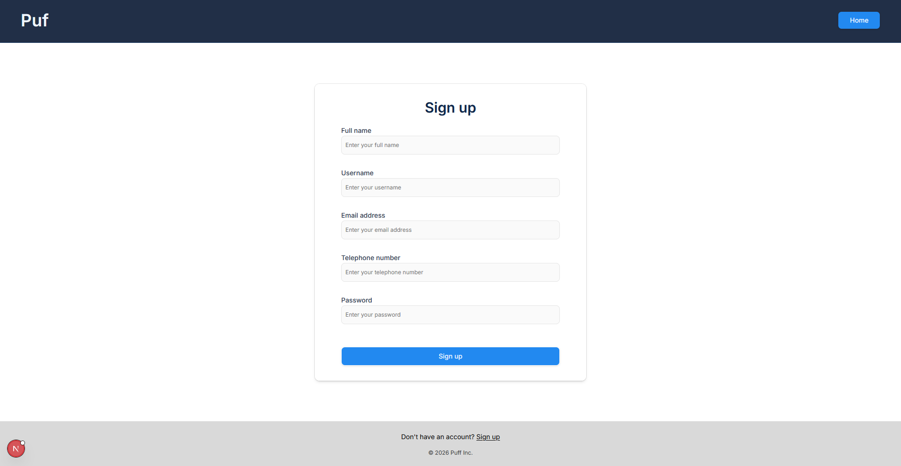
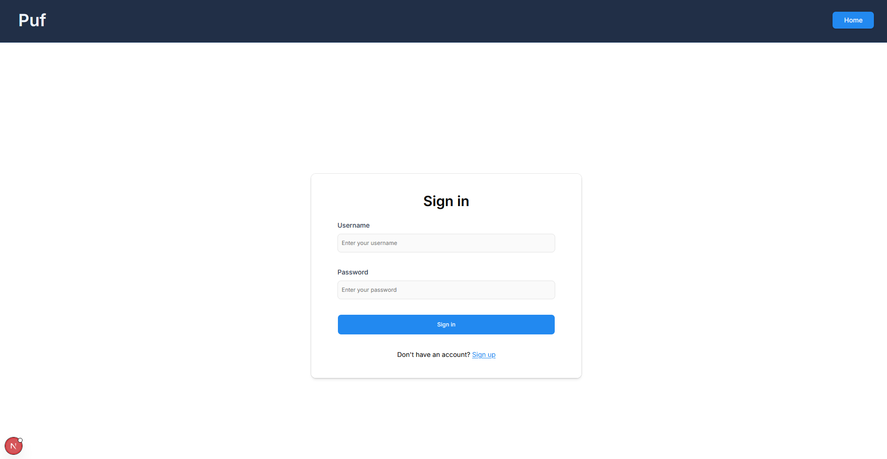
## Začetna stran

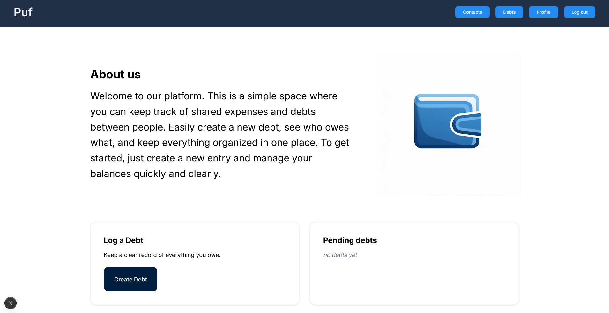
## Nastavitve

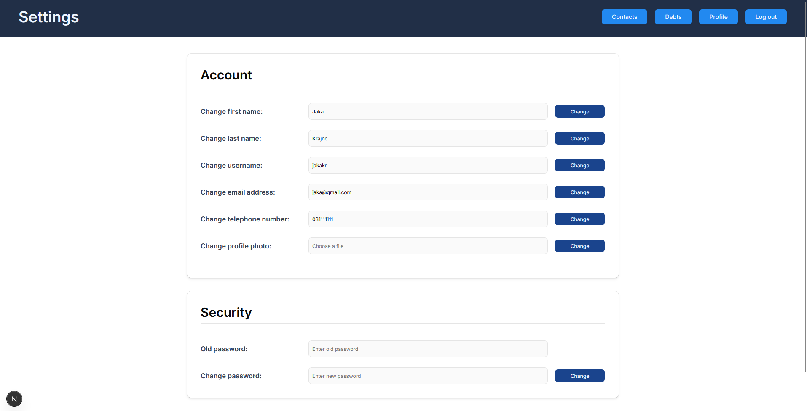
## Profil uporabnika

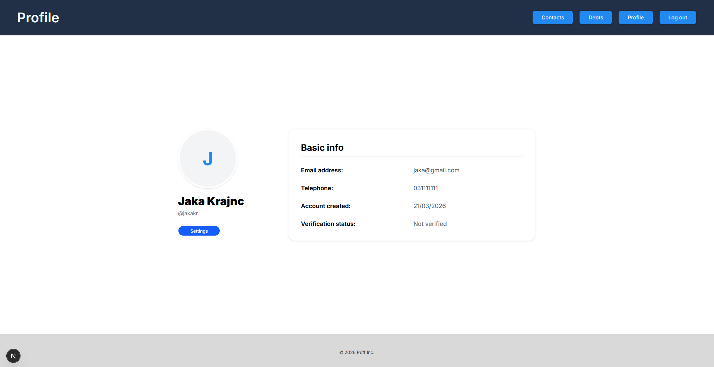
## Moji dolgovi

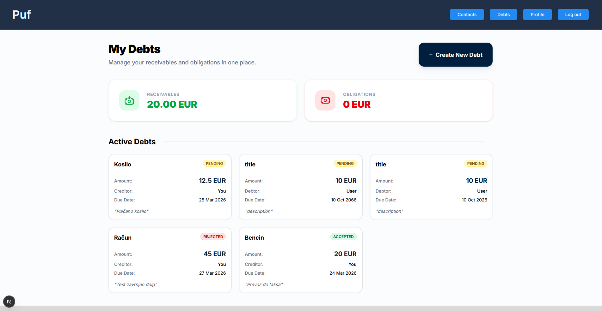
## Ustvari dolg

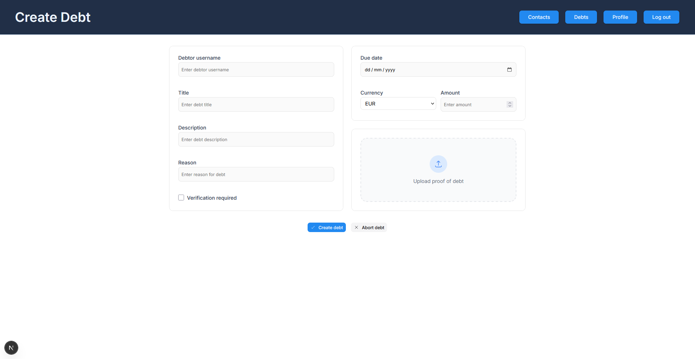
## Statistika

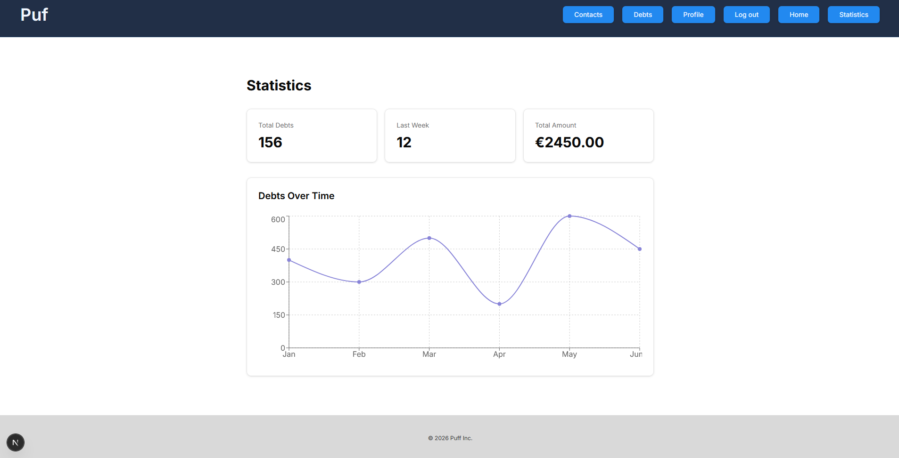
## Verifikacija identitete

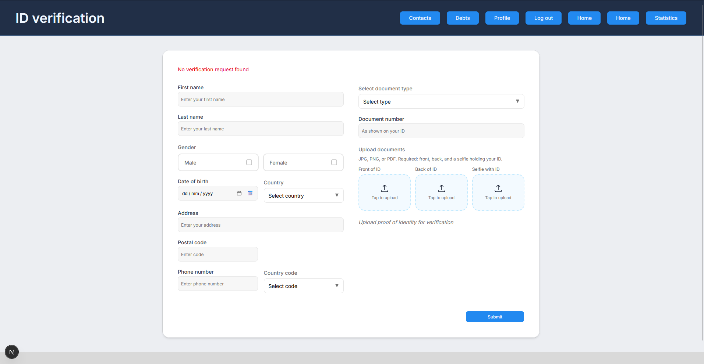
## Administratorska plošča

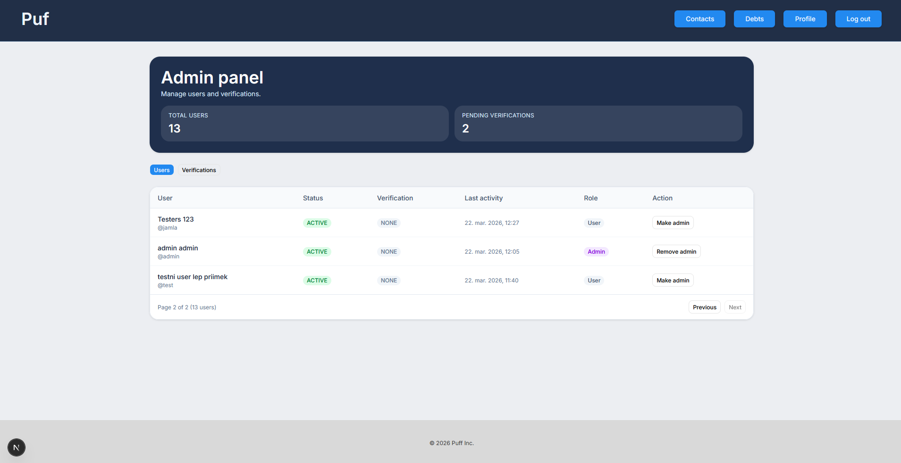
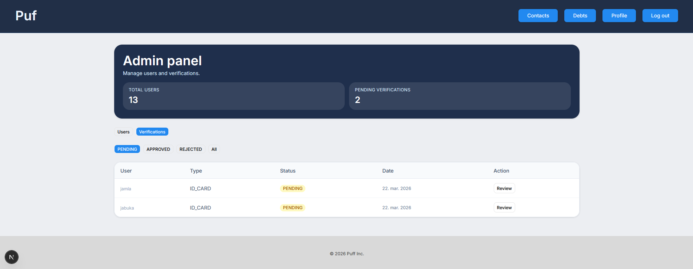
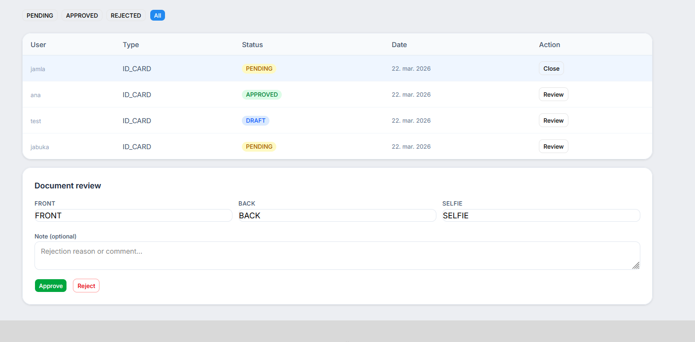

